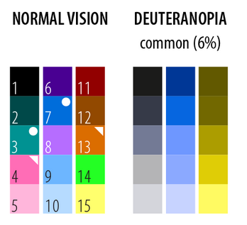

# Interface requirements

### Screen resolution

* Standard: 1366x768
* Adjusting window size
* Full screen mode

### Font

* Open sans light

### Colors

* Standard mode:
  * See: [start screen](https://mubbo.gitbook.io/project/~/edit/drafts/-LaHk04JOb-2JBuAqFOl/v/doc/interface-requirements/start-screen)
  * See: [app screen](https://mubbo.gitbook.io/project/~/edit/drafts/-LaHk04JOb-2JBuAqFOl/v/doc/interface-requirements/app-screen)
* Color blind mode:

